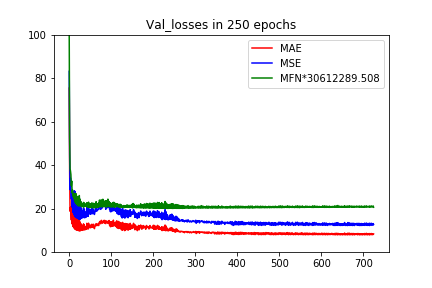
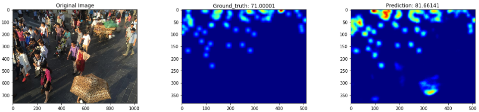

# W-Net-Keras
> Unofficial implementation of W-Net for crowd counting in Keras.

---

## Paper:

+ Original_paper: [_Varun Kannadi Valloli, Kinal Mehta. W-Net: Reinforced U-Net for Density Map Estimation_](<https://arxiv.org/abs/1903.11249>).

### Results now:

*On dataset ShanghaiTech B*

> Under development...

| MAE  |  MSE  | Mean of Frobenius Norm | MAPE  | PSNR  | SSIM |
| :--: | :---: | :--------------------: | :---: | :---: | :--: |
| 7.85 | 12.17 |        6.75e-7         | 6.46% | 29.27 | 0.93 |

### Dataset:

- **ShanghaiTech dataset**: [dropbox](<https://www.dropbox.com/s/fipgjqxl7uj8hd5/ShanghaiTech.zip?dl=0>) or [Baidu Disk](<http://pan.baidu.com/s/1nuAYslz>).

### Training Parameters:

1. *Loss* = MSE * 1000 + BCE * 10;

2. *Optimizer* = Adam(lr=1e-4, decay=5e-3);

3. *Batch size*: 1;

4. *Data augmentation*: Flip horizontally online randomly;

5. *Patch*: No patch;

6. *Batch normalization*: No BN layers at present;

7. *Weights*: Got best weights in epoch248(250 epochs in total), and here is the loss records:

   

8. *Prediction example*:

   

### Run:

1. Download dataset;
2. Data generation: run the`generate_datasets.ipynb `.
3. Run the `main.ipynb` to train, test, analyze and evaluate the image quality.
